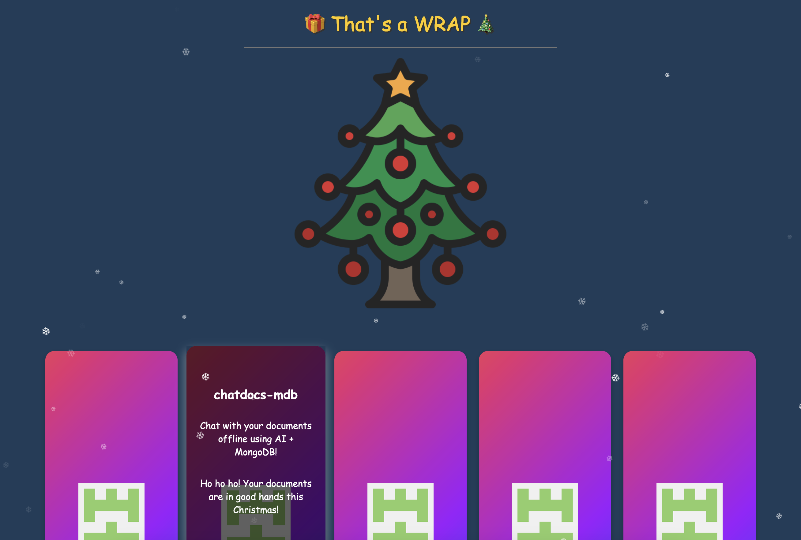

# thats-a-wrap



---

# Unwrapping GitHub Repositories

## 🎄 Crafting Visual Stories with AI 🎁

As the holiday season approaches, it's a wonderful time to reflect on personal achievements and share them in creative ways. For developers, GitHub repositories are more than just code—they're a testament to one's journey, learning, and passion. But how can you present them in a way that's engaging and festive?

Introducing **"That's a Wrap"**, a project that transforms your GitHub repositories into a delightful, Christmas-themed visual story. By leveraging the power of Large Language Models (LLMs), you can synthesize repository data into an interactive, offline HTML experience that's both informative and enchanting.

## Turning Code into a Festive Showcase

"That's a Wrap" isn't just about listing repositories; it's about narrating your development story through a festive lens. The project fetches your GitHub repositories and uses an LLM to generate creative, holiday-themed descriptions. These are then woven into a visually appealing HTML page, complete with animations and interactive elements.

### The Value of Visual Storytelling

In today's digital age, storytelling isn't confined to words—it's a blend of visuals, interactivity, and narrative. By presenting your repositories as wrapped gifts under a virtual Christmas tree, you're inviting others to explore your work in a novel and engaging way. This approach can:

- **Enhance Engagement**: Interactive visuals capture attention more effectively than plain text.
- **Showcase Creativity**: Demonstrate not just technical skills but also the ability to present information creatively.
- **Create Memorable Impressions**: A unique presentation is more likely to be remembered and shared.

## The Role of LLMs in Crafting Narratives

At the heart of "That's a Wrap" is the use of an LLM to generate descriptions and select repositories. Any LLM can be utilized for this purpose, and the quality of the output will depend on the underlying model. Models like GPT-4 offer advanced language capabilities, but even smaller models can produce impressive results.

### Structured JSON vs. Raw HTML

During development, I noticed a difference in inference time when requesting structured JSON objects versus raw HTML from the LLM. When asking the model to return a JSON array containing the necessary data, the response was faster and more efficient compared to generating the entire HTML content.

**Why is this the case?**

- **Simpler Output**: Generating JSON is a more straightforward task for the model, as it involves structured data without additional formatting.
- **Reduced Complexity**: HTML requires the model to produce correctly nested tags and handle more complex syntax, increasing the computational load.
- **Efficiency in Processing**: By requesting JSON, I can separate data generation from presentation, allowing for better optimization and flexibility.

This approach not only improves performance but also enhances maintainability. Designing the HTML template separately and injecting the dynamic data as needed makes it easier to update the visual aspects without modifying the underlying data generation logic.

## Crafting the Festive Experience

The visual component of "That's a Wrap" is designed to be both festive and functional. The HTML page features:

- **Animated Snowflakes**: Adds a dynamic, wintery feel to the page.
- **Gift Boxes for Repositories**: Each repository is presented as a gift box that, when clicked, reveals more information or redirects to the repository page.
- **Responsive Design**: Ensures the page looks great on all devices, from desktops to mobile phones.

By separating data and presentation, I focused on enhancing the user experience without worrying about affecting the data integrity.

## Flexibility with Different LLMs

One of the strengths of this project is its flexibility. You can use any LLM that you're comfortable with or have access to. Whether it's an open-source model or a proprietary one, the key is to tailor the prompts to guide the model in generating the desired output.

### Quality Depends on the Model

The sophistication of the generated descriptions and the creativity infused into them will vary based on the model used. Higher-end models like GPT-4 can produce more nuanced and engaging narratives, while simpler models might require more detailed prompts to achieve similar results.

**Tips for Working with Different Models:**

- **Adjust Your Prompts**: Be specific in your instructions to guide the model effectively.
- **Experiment**: Try different phrasing or provide examples to see how the output changes.
- **Post-Processing**: You might need to refine the generated text manually or with additional code for consistency.

## Synthesizing Content into Stories

The real magic happens when synthesizing raw repository data into compelling stories. By leveraging AI, it's possible to transform technical information into narratives that resonate on a personal level.

### Example of Transformation

- **Before**: A repository named "Data-Analysis-Project" with a description "Scripts for data analysis."
- **After**: "Unwrap the secrets of data with the 'Data Analysis Project'! Dive into a world where numbers tell stories and each script opens new insights."

This transformation adds a festive touch and makes the repository more inviting to explore.

## Technical Insights

While the focus is on the value and experience, it's worth noting some technical aspects that make this project effective:

- **API Interactions**: Using the GitHub API to fetch repository data programmatically.
- **Data Handling**: Converting API responses into formats suitable for the LLM and the HTML template.
- **Template Integration**: Injecting the AI-generated content into the HTML template seamlessly.

These elements come together to create an efficient pipeline from data retrieval to final presentation.

## Beyond the Holidays

While "That's a Wrap" is themed around Christmas, the concept can be adapted for other occasions or themes:

- **New Year's Showcase**: Highlight yearly achievements with fireworks animations.
- **Portfolio Presentations**: Use a professional theme to present work to potential employers.
- **Educational Showcases**: Adapt the idea for classroom settings to make learning more interactive.

The possibilities are limited only by creativity, and the approach demonstrates how AI and web technologies can be combined to create impactful experiences.

## Understanding the Script

Let's break down the script into its core components to understand how each part contributes to the overall functionality.

### Configuration and Setup

```python
import os
import json
from datetime import datetime, timedelta
from github import Github
from pymongo import MongoClient

THEME = "CHRISTMAS 🎄"
```

- **Imports**: The script imports necessary modules for handling environment variables, JSON operations, date and time manipulations, GitHub API interactions, and MongoDB connections.
- **THEME**: Sets the festive theme, which in this case is "CHRISTMAS 🎄".

### Writing Output to File

```python
def write_to_file(content, base_filename='thats-a-wrap-'):
    timestamp = datetime.now().strftime('%Y%m%d%H%M%S')  # current date and time as a string
    filename = f"{base_filename}_{timestamp}.html"
    try:
        with open(filename, 'w') as f:
            f.write(content)
    except Exception as e:
        print(f"An error occurred while writing to the file: {str(e)}") 
```

- **Function**: `write_to_file` creates an HTML file with a timestamped filename to ensure uniqueness.
- **Error Handling**: Catches and prints any exceptions that occur during the file writing process.

### GitHub API Integration

```python
def get_github_instance():
    token = os.getenv('GITHUB_TOKEN')
    if token:
        print("Authenticated with GitHub token.")
        return Github(token)
    else:
        print("No GitHub token found. Using anonymous access.")
        return Github()  # Anonymous access
```

- **Authentication**: Attempts to authenticate with GitHub using a personal access token. If not found, defaults to anonymous access, which has limited rate limits.

### MongoDB Connection

```python
def get_mongo_client():
    mongo_uri = os.getenv('MONGO_URI', 'mongodb://localhost:27017/?directConnection=true')
    client = MongoClient(mongo_uri)
    return client
```

- **Connection**: Connects to MongoDB using the URI provided in the environment variable `MONGO_URI`. Defaults to a local MongoDB instance if not specified.

### Configuring Search Parameters

```python
def configure_search_parameters():
    search_params = {
        'username': 'ranfysvalle02',   # GitHub username to search
        'language': 'Python',          # Primary language of repositories
        'min_stars': 1,                # Minimum number of stars
        'updated_within_months': 12    # Repositories updated within the last N months
    }
    return search_params
```

- **Customization**: Defines the criteria for selecting repositories:
  - **Username**: The GitHub user whose repositories are being showcased.
  - **Language**: Filters repositories based on the primary programming language.
  - **Minimum Stars**: Ensures only repositories with a certain level of popularity are included.
  - **Update Recency**: Includes repositories updated within the last specified number of months.

### Fetching GitHub Repositories

```python
def search_repositories_pygithub(github_instance, search_params):
    username = search_params['username']
    try:
        user = github_instance.get_user(username)
    except Exception as e:
        print(f"Error fetching user '{username}': {e}")
        return []

    public_repos = user.get_repos(type='public')

    since_date = datetime.now() - timedelta(days=30 * search_params['updated_within_months'])

    matching_repos = []

    for repo in public_repos:
        if repo.language != search_params['language']:
            continue
        if repo.stargazers_count < search_params['min_stars']:
            continue
        if repo.updated_at < since_date:
            continue

        matching_repos.append({
            'name': repo.name,
            'description': repo.description,
            'stars': repo.stargazers_count,
            'forks': repo.forks_count,
            'language': repo.language,
            'updated_at': repo.updated_at.strftime('%Y-%m-%d'),
            'url': repo.html_url,
            'username': username
        })

    return matching_repos
```

- **User Retrieval**: Fetches the specified GitHub user's public repositories.
- **Filtering**: Applies the defined search parameters to filter repositories.
- **Data Extraction**: Gathers relevant information from each qualifying repository.

### Storing Data with MongoDB

```python
def main():
    github_instance = get_github_instance()
    search_params = configure_search_parameters()
    mongo_client = get_mongo_client()
    db = mongo_client['sample_training']
    repo_collection = db['github']

    # Check if indexes exist before creating them
    if 'language_1' not in repo_collection.index_information():
        repo_collection.create_index([('language', 1)])
    if 'stars_-1' not in repo_collection.index_information():
        repo_collection.create_index([('stars', -1)])

    matching_repos = search_repositories_pygithub(github_instance, search_params)

    for repo in matching_repos:
        # Use a combination of 'name' and 'username' to uniquely identify repositories
        repo_collection.update_one(
            {'name': repo['name'], 'username': repo['username']},
            {'$set': repo},
            upsert=True
        )
```

- **Database Setup**: Connects to the MongoDB database and ensures necessary indexes are in place for efficient querying.
- **Data Insertion**: Inserts or updates repository data in the MongoDB collection to maintain the latest information.

### Generating Festive Descriptions

```python
def generate_festive_description(repo, username):
    from openai import AzureOpenAI
    client = AzureOpenAI(
        api_key="",  
        api_version="2024-10-21",
        azure_endpoint="https://.openai.azure.com"
    )
    response = client.chat.completions.create(
        model="gpt-4o",
        messages=[
            {"role": "user", "content": f"""
Given the following repository data:

Name: {repo['name']}
Description: {repo['description'] or 'No description provided.'}
Stars: {repo['stars']}
Forks: {repo['forks']}
Language: {repo['language']}
Updated At: {repo['updated_at']}
URL: {repo['url']}

Generate an engaging description for the repository, focusing on the following points:
- What makes it unique?
- What's special about it?
- THEME: {THEME}

The description should be written in a friendly and engaging manner, with a maximum of 15 words.

IMPORTANT!
- DO NOT INCLUDE LINKS IN THE DESCRIPTION.
- DO NOT INCLUDE THE REPOSITORY NAME IN THE DESCRIPTION.
- MAXIMUM LENGTH IS 15 WORDS.
- USE EMOJIS IN THE DESCRIPTION STRATEGICALLY TO CREATE A FESTIVE ENVIRONMENT.
- THEME: {THEME}
""" },
        ]
    )
    festive_description = response.choices[0].message.content.strip()
    return festive_description
```

- **OpenAI Integration**: Utilizes OpenAI's language models via Azure to generate concise, festive descriptions for each repository.
- **Customization**: Ensures the descriptions are themed appropriately (e.g., Christmas), include emojis, and adhere to length constraints.
- **Best Practices**: Enforces guidelines to maintain consistency and avoid redundancy.

### Creating the Festive HTML Output

```python
    top_repos = list(repo_collection.aggregate([
        {'$match': {'language': search_params['language']}},
        {'$sort': {'stars': -1}},
        {'$limit': 6}
    ]))

    for repo in top_repos:
        if 'festive_description' not in repo:
            festive_description = generate_festive_description(repo, search_params['username'])
            repo_collection.update_one(
                {'_id': repo['_id']},
                {'$set': {'festive_description': festive_description}}
            )
            repo['festive_description'] = festive_description

    giftsData = []
    for idx, repo in enumerate(top_repos, 1):
        giftsData.append({
            'repoNumber': idx,
            'name': repo['name'],
            'description': repo['festive_description'],
            'imageUrl': f"https://github.com/{search_params['username']}.png",
            'repoUrl': repo['url']
        })

    with open('githubber.html', 'r') as file:
        html_raw = file.read()

    html = html_raw.replace('___GIFTS_DATA___', json.dumps(giftsData))

    write_to_file(html)
```

- **Aggregation**: Selects the top 6 repositories based on star count within the specified language.
- **Description Generation**: For each top repository lacking a festive description, the script generates one and updates the database.
- **Data Preparation**: Compiles the repository data into a `giftsData` list, including repository details and the user's GitHub avatar.
- **HTML Generation**: Reads a template HTML file (`githubber.html`), injects the `giftsData` JSON, and writes the final HTML output using the `write_to_file` function.

---

## Running the Script

To execute the script:

1. **Set Environment Variables**:
   - `GITHUB_TOKEN`: Your GitHub personal access token.
   - `MONGO_URI`: (Optional) Your MongoDB connection string. Defaults to `mongodb://localhost:27017/?directConnection=true` if not set.
   
   Example (Linux/Mac):
   ```bash
   export GITHUB_TOKEN='your_github_token_here'
   export MONGO_URI='your_mongodb_uri_here'
   ```

2. **Configure the Script**:
   - Update the `configure_search_parameters` function with your GitHub username or desired search criteria.
   - Ensure the `generate_festive_description` function is correctly configured with your OpenAI Azure credentials.

3. **Prepare the HTML Template**:
   - Create a `githubber.html` file with a placeholder `___GIFTS_DATA___` where the repository data should be injected.

```githubber.html
<!DOCTYPE html>
<html lang="en">
<head>
    <meta charset="UTF-8">
    <title>That's a WRAP</title>
    <style>
        /* Basic Styles */
        body {
            font-family: 'Comic Sans MS', cursive, sans-serif;
            background-color: #1e3d59;
            margin: 0;
            padding: 0;
            overflow-x: hidden;
            position: relative;
            min-height: 100vh;
            display: flex;
            flex-direction: column;
            align-items: center;
            color: #ffffff;
        }

        /* Snow Effect */
        .snowflakes {
            position: fixed;
            top: 0;
            left: 0;
            width: 100%;
            height: 100%;
            pointer-events: none;
            z-index: 9998;
        }

        .snowflake {
            position: absolute;
            top: -10px;
            color: #FFF;
            user-select: none;
            pointer-events: none;
            animation: fall linear infinite;
            opacity: 0.8;
        }

        @keyframes fall {
            0% {
                transform: translateY(0) rotate(0deg);
            }
            100% {
                transform: translateY(100vh) rotate(360deg);
            }
        }

        /* Festive Header */
        .header {
            text-align: center;
            font-size: 2em;
            color: #ffcc00;
            text-shadow: 2px 2px #333333;
            padding: 0;
            margin: 20px 0;
        }

        /* Gift Grid */
        .gift-grid {
            display: grid;
            grid-template-columns: repeat(auto-fit, minmax(150px, 1fr));
            grid-gap: 20px;
            width: 90%;
            max-width: 1200px;
            margin: 20px auto;
            padding: 20px;
            box-sizing: border-box;
        }

        /* Gift Box */
        .gift {
            position: relative;
            cursor: pointer;
            transition: transform 0.3s ease, box-shadow 0.3s ease;
        }

        .gift:hover {
            transform: scale(1.05);
            box-shadow: 0 8px 16px rgba(255,255,255,0.5);
        }

        .gift-inner {
            position: relative;
            width: 100%;
            padding-top: 100%; /* 1:1 Aspect Ratio */
            background: linear-gradient(135deg, #ff8a00 25%, #e52e71 50%, #9c1aff 75%, #007fff 100%);
            background-size: 300% 300%;
            animation: gradientAnimation 8s ease infinite;
            border-radius: 15px;
            box-shadow: 0 4px 8px rgba(0,0,0,0.2);
            overflow: hidden;
            display: flex;
            align-items: center;
            justify-content: center;
        }

        @keyframes gradientAnimation {
            0% {
                background-position: 0% 50%;
            }
            50% {
                background-position: 100% 50%;
            }
            100% {
                background-position: 0% 50%;
            }
        }

        .gift-inner img {
            width: 50%;
            height: auto;
            object-fit: cover;
        }

        .gift-content {
            position: absolute;
            top: 0;
            left: 0;
            width: 100%;
            height: 100%;
            padding: 15px;
            box-sizing: border-box;
            text-align: center;
            color: #fff;
            background-color: rgba(0,0,0,0.6);
            opacity: 0;
            transition: opacity 0.3s;
            display: flex;
            flex-direction: column;
            justify-content: center;
            border-radius: 15px;
        }

        .gift:hover .gift-content {
            opacity: 1;
        }

        .gift-content h2 {
            font-size: 1.2em;
            margin-bottom: 10px;
            color: #fff;
        }

        .gift-content p {
            font-size: 0.9em;
            color: #fff;
        }

        
        /* Snowflake Sizes */
        .snowflake.small {
            font-size: 10px;
            animation-duration: 10s;
            opacity: 0.6;
        }

        .snowflake.medium {
            font-size: 14px;
            animation-duration: 15s;
            opacity: 0.8;
        }

        .snowflake.large {
            font-size: 18px;
            animation-duration: 20s;
            opacity: 1;
        }
    </style>
</head>
<body>
    <!-- Snowflakes -->
    <div class="snowflakes" aria-hidden="true">
        <!-- Snowflakes will be generated by JavaScript -->
    </div>

    <!-- Festive Header -->
    <div class="header">🎁 That's a WRAP 🎄<hr/></div>

    <!-- Gift Grid -->
    <div class="gift-grid">
        <!-- Gifts will be generated by JavaScript -->
    </div>

    
    <!-- JavaScript -->
    <script>
        // Snowflakes
        function createSnowflakes() {
            const count = 50;
            const snowflakesContainer = document.querySelector('.snowflakes');
            const bodyWidth = document.body.clientWidth;

            for (let i = 0; i < count; i++) {
                const snowflake = document.createElement('div');
                snowflake.classList.add('snowflake');
                const sizeClass = ['small', 'medium', 'large'][Math.floor(Math.random() * 3)];
                snowflake.classList.add(sizeClass);
                snowflake.textContent = '❄';
                snowflake.style.left = Math.random() * 100 + '%';
                snowflake.style.animationDuration = (Math.random() * 10 + 5) + 's';
                snowflake.style.opacity = Math.random();
                snowflake.style.top = Math.random() * 100 + 'px';
                snowflakesContainer.appendChild(snowflake);
            }
        }

        createSnowflakes();

        // Gift Data (Loaded from JavaScript Array)
        const giftsData = ___GIFTS_DATA___;

        // Generate Gifts
        function generateGifts() {
            const giftGrid = document.querySelector('.gift-grid');

            giftsData.forEach(giftData => {
                const gift = document.createElement('div');
                gift.classList.add('gift');
                gift.setAttribute('data-repo', giftData.repoNumber);

                // Gift Inner
                const giftInner = document.createElement('div');
                giftInner.classList.add('gift-inner');

                // Image Placeholder
                const img = document.createElement('img');
                img.src = giftData.imageUrl;
                img.alt = giftData.name;

                giftInner.appendChild(img);

                // Gift Content
                const giftContent = document.createElement('div');
                giftContent.classList.add('gift-content');

                const h2 = document.createElement('h2');
                h2.textContent = giftData.name;
                giftContent.appendChild(h2);

                const p = document.createElement('p');
                p.textContent = giftData.description;
                giftContent.appendChild(p);

                gift.appendChild(giftInner);
                gift.appendChild(giftContent);
                giftGrid.appendChild(gift);

                // add click event listener
                gift.addEventListener('click', function() {
                    window.open(giftData.repoUrl, '_blank');
                });
            });

           
        }

        generateGifts();

    </script>
</body>
</html>
```
   

4. **Execute the Script**:
   ```bash
   python demo.py
   ```

Upon execution, the script will generate an HTML file with a festive showcase of your top GitHub repositories, complete with holiday-themed descriptions and visuals.

## Conclusion

"That's a Wrap" is more than a festive project—it's an exploration of how AI can enrich the way we share and perceive information. By turning repositories into a visual story, it's possible to engage audiences in new ways and showcase work beyond traditional formats. Celebrating your GitHub repositories during the holiday season is a wonderful way to showcase your projects and engage with your community. By automating the process with Python, MongoDB, and OpenAI, you can create a dynamic and festive presentation that highlights your top work with creative flair. 

Whether you're a developer looking to add some holiday cheer to your portfolio or a team aiming to share achievements in a fun way, this script provides a customizable and scalable solution. Embrace the festive spirit and let your repositories shine!

Happy Holidays and Happy Coding! 🎄✨

---

## Appendix: Additional Insights and Observations

### Performance Optimization with LLMs

- **Inference Time**: Requesting structured data like JSON significantly reduces inference time compared to asking for complex formats like HTML. This is because the model spends less computational effort generating plain text with less formatting complexity.
- **Resource Utilization**: By optimizing prompts and output formats, you can make better use of limited resources, especially when working with larger models that require more computational power.

### Separation of Concerns in Development

- **Data vs. Presentation**: Separating the data generation from the presentation layer allows for greater flexibility and maintainability. Changes to the visual aspects of the project can be made without affecting the logic that handles data retrieval and processing.
- **Template Management**: Utilizing HTML templates and injecting dynamic content can streamline the development process and make it easier to update the user interface.

### Potential Applications of the Concept

- **Marketing and Promotion**: Similar approaches can be used to create engaging promotional materials for products or services.
- **Personal Branding**: Developers and professionals can use AI-generated narratives to enhance their personal portfolios or resumes.
- **Education and Training**: Educators can adopt this method to create interactive learning materials that make complex topics more accessible.

### Ethical Considerations

- **AI Bias and Creativity**: While AI can generate creative content, it's important to review and ensure that the output is appropriate and free from unintended biases or inaccuracies.
- **Attribution and Transparency**: When using AI-generated content, it's good practice to acknowledge the use of AI and provide transparency about how the content was created.
